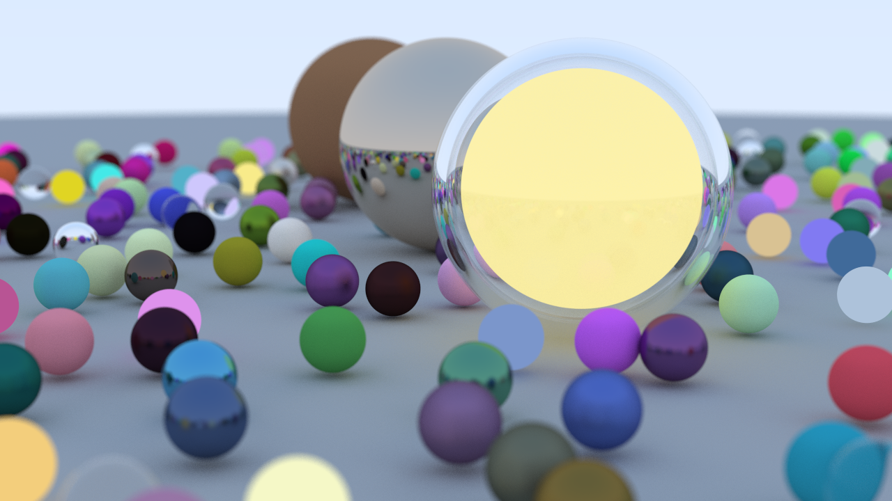
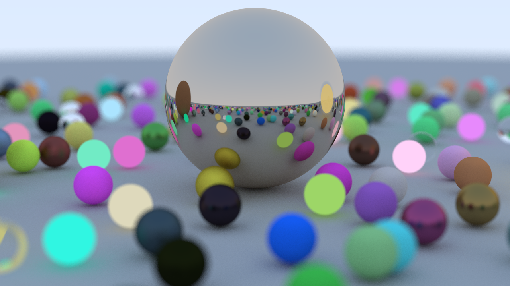
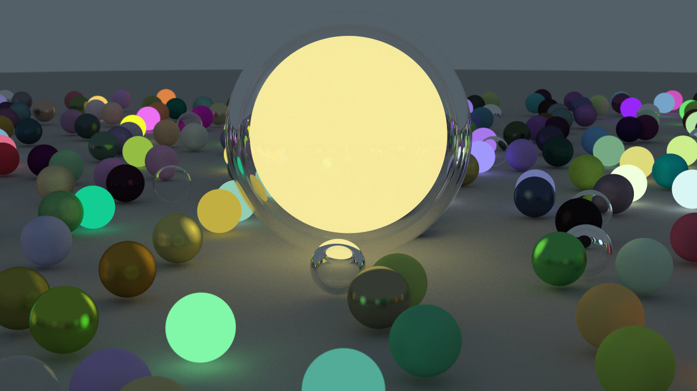

# Rust Ray Tracer


*<p align="center">**(Render from the Engine!)**</p>*

A high-performance, multithreaded ray tracing engine built from scratch in Rust. This project renders a complex, procedurally generated scene with physically-based materials including diffuse surfaces, metals, and dielectrics (glass). It demonstrates key computer graphics principles and leverages Rust's powerful concurrency model for significant performance gains.

---

## Gallery

Here are some scenes rendered with the engine. For best results, render at high resolution (e.g., 1280x720) and use a high sample count to produce clean, noise-free images.

| The Main Scene but now in the dark! | Depth-of-Field Showcase | Close-up on the Glass Orb |
| :---: |:---:|:---:|
|  |  |  |
| The final scene generated by `main.rs`, featuring hundreds of random spheres but now in a dark setting. | A shot focusing on a single sphere, using the camera's depth-of-field. | A close-up on the complex sphere in a darker setting to highlight the refraction and internal light source. |

---

## Features

-   [x] **Multithreaded Rendering:** Utilizes `std::thread` and `Arc` to parallelize the rendering process across all available CPU cores, dramatically reducing render times. The time reduction is about x16 comparing to single-threaded when creating 16 threads on a CPU capable of procressing all of those threads concurrently.
-   [x] **Configurable Camera:** A fully implemented camera with adjustable field-of-view, position, and **Depth of Field (Defocus Blur)**.
-   [x] **Advanced Material System:**
    -   [x] **Lambertian (Diffuse):** Simulates matte surfaces with realistic light scattering.
    -   [x] **Metal (Reflective):** Simulates metallic surfaces with configurable reflection fuzziness.
    -   [x] **Dielectric (Refractive):** Simulates transparent materials like glass and water using Snell's Law for refraction.
    -   [x] **Emissive (Light Emitting):** Allows objects to act as light sources, contributing to global illumination.
-   [x] **Procedural Scene Generation:** The main scene is generated at runtime, placing hundreds of spheres with randomized positions and materials.
-   [x] **Object Primitives:**
    -   [x] Spheres

-   [ ] **(Planned)** Bounding Volume Hierarchy (BVH) for render acceleration.
-   [ ] **(Planned)** Support for Triangle Meshes (loading `.obj` files).

---

## Getting Started

### Prerequisites

-   [Rust & Cargo](https://www.rust-lang.org/tools/install)

### Running the Engine

The scene is currently hardcoded in `src/main.rs`.

1.  Clone the repository:
    ```bash
    git clone https://github.com/Kanay2005/ray-tracing.git
    cd ray-tracing
    ```

2.  Run the project in release mode for optimal performance:
    ```bash
    cargo run --release
    ```

3.  The final render will be saved as `render.png` in the root directory. The process can take several minutes depending on your hardware.

---

## Technical Learnings

This engine simulates the physics of light by tracing rays from the camera into the scene to determine the color of each pixel. This is achieved through a few core steps:

*   **Cast & Intersect:** A ray is sent from the camera through a pixel. The engine finds the closest object in the scene that this ray hits.

*   **Bounces:** When a ray hits an object, the material determines its next path—scattering off matte surfaces, reflecting off metal, or refracting through glass. This process repeats, accumulating color with each bounce to create photorealistic global illumination.

*   **Samples:** To achieve realism and avoid sharp, jagged graphics, hundreds of rays (samples) are cast for each pixel, each with a slight random variation. Averaging the results produces key effects like **soft shadows, anti-aliasing, and depth-of-field blur**.

This project was then made significantly faster through a deep dive into Rust's performance and safety features in the context of concurrency.

-   **Fearless Concurrency:** Using `Arc<T>` for shared, thread-safe ownership of scene data (like materials and objects) was critical. This avoids costly data clones for each thread while guaranteeing memory safety, which is a core strength of Rust.
-   **Dynamic Dispatch:** The use of trait objects (`Box<dyn Material>`) provides a flexible material system. It allows any object that implements the `Material` trait to be stored and used interchangeably at runtime, making it easy to extend the engine with new material types without changing the core rendering logic.

---

## License

This project is licensed under the MIT License - see the [LICENSE.md](LICENSE.md) file for details.